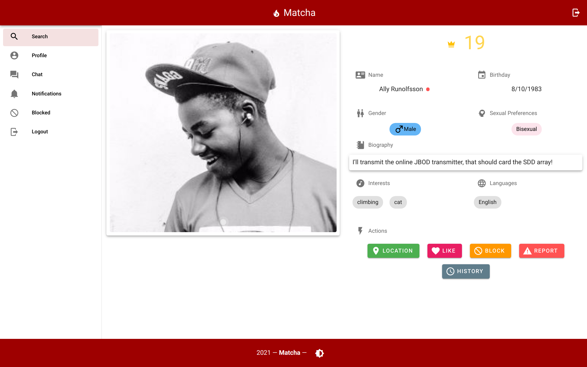
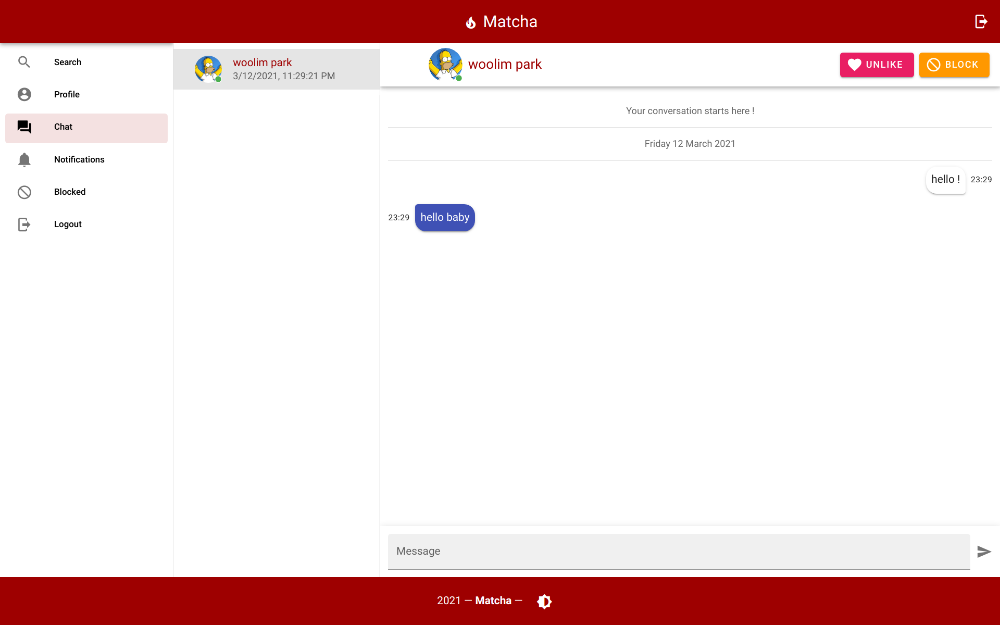

# matcha

## Overview

`matcha` is one of web-project in école 42. The purpose of this project is to create a dating website like `Tinder`. Usage of `ORM`, `validators`, `User Accounts Manager`, `NoSQL Database` is **strictly forbidden** in this project.

|       light mode        |          dark mode           |
| :---------------------: | :--------------------------: |
|   |   |
|  |  |

|         chat         |         notification         |
| :------------------: | :--------------------------: |
|  |  |

|         mobile         |         map         |
| :--------------------: | :-----------------: |
|  |  |

|     scroll pagination     |
| :-----------------------: |
|  |

## Feature

-   Dark mode
-   Realtime Chat
-   Google Oauth2 login
-   Interactive Google Map
-   Mobile support responsive UI
-   Mailing service(verification email / reset password)
-   Tracking location based on IP address if user don't allow browser gps.
-   Suggestion based on user's interest, age, language, sexual orientation(hetrosexual, bisexual, homosexual).
-   pagination with scroll event
-   Auto generated 500 seed users
-   jwt authentication flow (access token, refresh token)

## Contributer

-   [ncolomer](https://github.com/glagan)
-   [wpark](https://github.com/woolimi)
